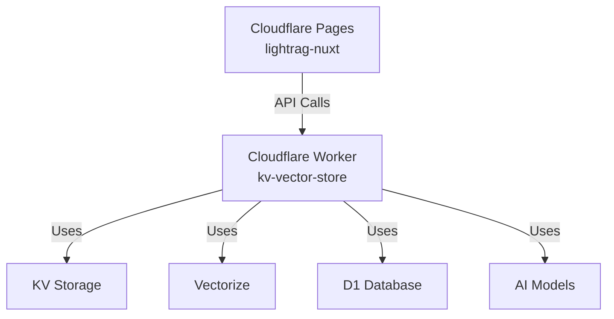

File Restrictions
	•	Maximum 20,000 files per site
	•	Individual file size limit of 25 MiB
	•	Headers file (`_headers`) restrictions:
	•	Maximum 100 header rules
	•	2,000 character limit per individual header