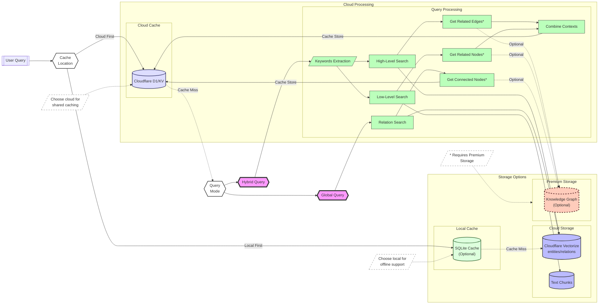

### LightRAG 2.0 Query #Cloud-First-for-Efficiencyˆ

## Processing Pipeline
The query processing utilizes:
- Embedder: @cf/baai/bge-base-en-v1.5 for semantic search
  - Input Limit: 512 tokens
  - Output: 768-dimensional embeddings
- LLM: @cf/meta/llama-2-7b-chat-int8 for keyword extraction and answer generation
- Hybrid Search: Combines semantic (70%) and keyword (30%) scoring
- Cache: Uses Cloudflare KV with 1-hour TTL

## Technical Specifications
- Maximum Query Length: 512 tokens
- Embedding Model: @cf/baai/bge-base-en-v1.5
  - Input: Up to 512 tokens
  - Output: 768-dimensional vectors
- Vector Search: Cloudflare Vectorize
- Results Cache: Cloudflare KV (1h TTL)
- Metadata Store: Cloudflare D1

