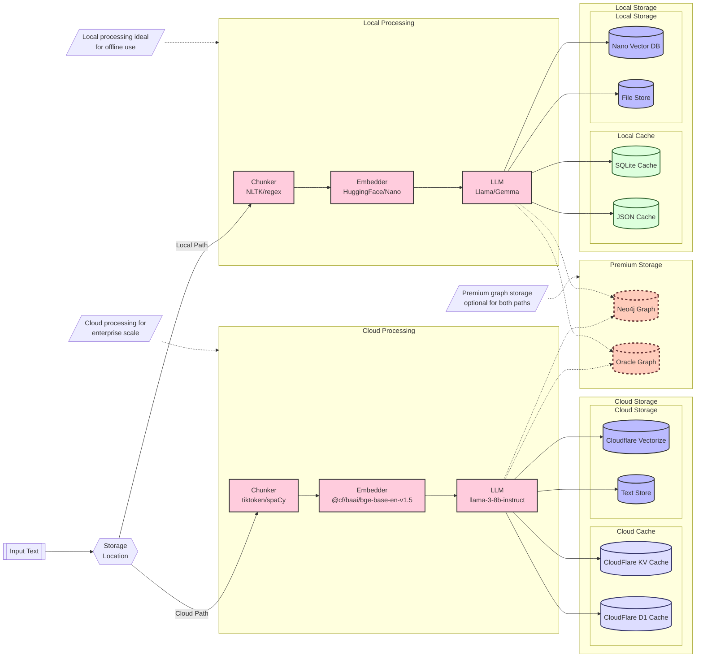

# LightRAG 2.0 Upsert Architecture

## Cloud Processing Pipeline
The cloud processing path utilizes high-performance cloud services:
- Chunker: Uses tiktoken/spaCy for text segmentation (512 token limit per chunk)
- Embedder: Uses @cf/baai/bge-base-en-v1.5 (768-dimensional embeddings, 512 token input limit) [details]
(https://docs.latenode.com/docs/722c823e-e550-42ea-8c99-2a3e77cfc708/?t)
- LLM: Uses @cf/meta/llama-2-7b-chat-int8 for text processing [details](https://
blog.cloudflare.com/meta-llama-3-available-on-cloudflare-workers-ai?t/)
- Storage: Utilizes Cloudflare KV for caching, Vectorize for embeddings, D1 for metadata

## Technical Specifications
- Input Token Limit: 512 tokens per text chunk
- Embedding Dimensions: 768
- Vector Storage: Cloudflare Vectorize
- Metadata Storage: Cloudflare D1
- Cache Layer: Cloudflare KV

## Local Processing Pipeline
The local processing path focuses on offline capabilities:
- Chunker: COMING SOON
- Embedder: COMING SOON
- LLM: COMING SOON
- Storage: COMING SOON
#Cloud-First-for-Efficienty

## Storage Options
Multiple storage tiers are available:
1. Cloud Storage:
   - D1 and KV for fast caching and metadata
   - Vectorize DB for cloud-scale vector storage (768-dimensional vectors)
   - D1 for relational queries and stats

2. Local Storage: COMING SOON
   - SQLite/JSON for local caching
   - Nano Vector DB for embedded vector storage
   - File Store for document management

3. Premium Storage (Optional):
   - Neo4j Graph for advanced relationships
   - Oracle Graph for enterprise deployments

## Processing Flow
1. Default configuration is cloud processing and storage
2. Input text is received
3. Text is processed through appropriate pipeline:
   - Cloud: tiktoken → OpenAI → GPT-4 → Cloud Storage
   - Local: NLTK → Nano → Llama → Local Storage
4. Optional premium storage integration for both paths
```

### LightRAG 2.0 Upsert #Cloud-First-for-Efficiency

